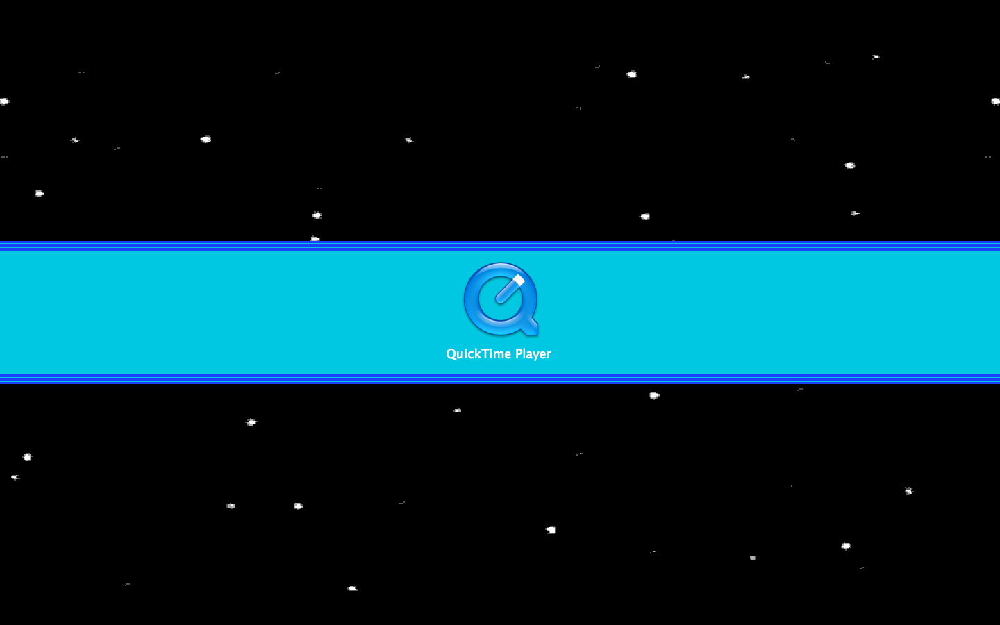

# MegaManEffect

The MegaManEffect is an application that emulates an effect seen in the classic NES game Mega Man 2. When you launch a Mac OS X application, the screen goes dark, stars sweep the night sky and your application's icon is presented in a blue letter box bar with a cheesy 8-bit music introduction.

MegaManEffect was written while I attended the ADHOC/MacHack conference in 2004 and took second place in the ADHOC Labs Showcase! In the summer of 2005 the application hit a nerve in the community generating tons of interest and downloads. It is to this day one of the most distributed pieces of code I've even written. 

For awhile after various personal site redesigns,  the MegaManEffect download page had disappeared. After many, many emails in 2007 I finally put it back online and even upgraded it to a Universal Binary so it runs great on Intel Macs. 

* [Download the MegaManEffect Application](https://github.com/zorn/MegaManEffect/releases/download/1.1/MegaManEffect.app.zip)
* [See MegaManEffect demoed on Attack of the Show](http://www.youtube.com/watch?v=U6q3vfQKTJI)
* [See the original MegaMan 2 game in action](http://www.youtube.com/watch?v=eGDBXnWpvmE) 

The source for MegaManEffect is available under a BSD license.

While the app binary still works, the code itself isn't terribly good. It was written as I was still learning Cocoa (2004) and currently doesn't build under 10.9 but I'm going to archive it here for now anyways.
